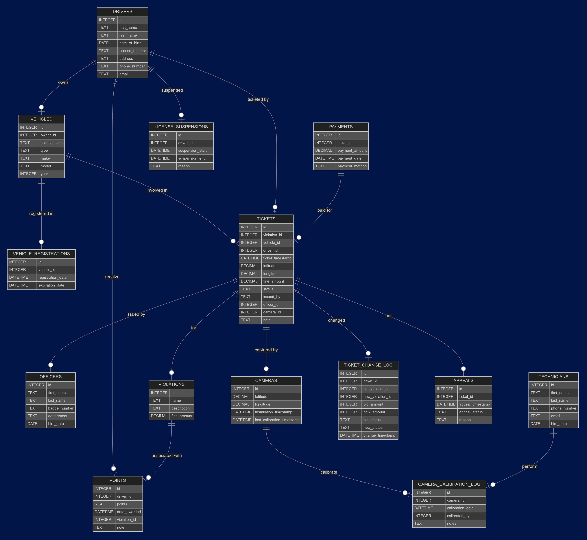

# Design Document
By Krish Kumar (Made for CS50 SQL's final project)

[Video Overview](https://youtu.be/B-2aap91ZIE)

# Scope
This database is designed to make streamline the recording, tracking, and management of traffic tickets issued by both law enforcement officers and automated speed cameras. This system aims to reduce errors, enhance efficiency and make it easier to manage traffic tickets by both police departments and drivers alike.

# Entities
This section outlines the different tables, views and indexes present in the database

## Tables
The database has 6 tables, namely:

### 1. `drivers`
Contains information about drivers (for convenience, **drivers are _also_ the owners** of vehicles)

| Column | Data Type | Description |
|------------|--------------|-----------------|
| `id` | INTEGER (PK) | Unique identifier for each driver |
| `first_name` | TEXT | Driver's first name |
| `last_name` | TEXT | Driver's last name |
| `date_of_birth` | DATE | Driver's date of birth |
| `license_number` | TEXT (UNIQUE) | Unique driver's license number |
| `address` | TEXT | Driver's address |
| `phone_number` | TEXT | Driver's phone number |
| `email` | TEXT | Driver's email address |

### 2. `vehicles`
Contains information about vehicles (as said above, **`owner_id`  references `drivers.id`**)

| Column | Data Type | Description |
|------------|--------------|-----------------|
| `id` | INTEGER (PK) | Unique identifier for each vehicle |
| `owner_id` | INTEGER (FK) | Owner of the vehicle (references `drivers.id`) |
| `license_plate` | TEXT | Unique license plate number |
| `type` | TEXT | Type of vehicle |
| `make` | TEXT | Vehicle manufacturer |
| `model` | TEXT | Model of the vehicle |
| `year` | INTEGER | Year of manufacture |

### 3. `vehicle_registrations`
Contains the registration information of vehicles.

| Column | Data Type | Description |
|------------|--------------|-----------------|
| `id` | INTEGER (PK) | Unique identifier for each registration |
| `vehicle_id` | INTEGER (FK) | Vehicle being registered (references `vehicles.id`) |
| `registration_date` | DATETIME | Date of registration |
| `expiration_date` | DATETIME | Expiration date of the registration |

### 4. `officers`
Contains information about officers who can issue tickets in `tickets`

| Column | Data Type | Description |
|------------|--------------|-----------------|
| `id` | INTEGER (PK) | Unique identifier for each officer |
| `first_name` | TEXT | Officer's first name |
| `last_name` | TEXT | Officer's last name |
| `badge_number` | TEXT | Unique badge number |
| `department` | TEXT | Department the officer belongs to |
| `hire_date` | DATE | Date of hire |

### 5. `technicians`
Contains information about technicians who can calibrate cameras in `camera_calibration_log`

| Column | Data Type | Description |
|------------|--------------|-----------------|
| `id` | INTEGER (PK) | Unique identifier for each technician |
| `first_name` | TEXT | Technician's first name |
| `last_name` | TEXT | Technician's last name |
| `phone_number` | TEXT | Technician's phone number |
| `email` | TEXT | Technician's email address |
| `hire_date` | DATE | Date of hire |

### 5. `cameras`
Contains information about speed cameras and can be calibrated in `camera_calibration_log`

| Column | Data Type | Description |
|------------|--------------|-----------------|
| `id` | INTEGER (PK) | Unique identifier for each camera |
| `latitude` | DECIMAL(8,6) | Latitude of the camera location |
| `longitude` | DECIMAL(9,6) | Longitude of the camera location |
| `installation_timestamp` | DATETIME | Date and time of installation |
| `last_calibration_timestamp` | DATETIME | Last calibration date and time |

### 6. `camera_calibration_log`
Contains calibration logs of `cameras`

| Column | Data Type | Description |
|------------|--------------|-----------------|
| `id` | INTEGER (PK) | Unique identifier for each calibration log |
| `camera_id` | INTEGER (FK) | Camera being calibrated (references `cameras.id`) |
| `calibration_date` | DATETIME | Date of calibration |
| `calibrated_by` | INTEGER (FK) | Technician who performed calibration (references `technicians.id`) |
| `notes` | TEXT | Additional notes about the calibration |

### 7. `violations`
Contains violations that can be used to issue `tickets`

| Column | Data Type | Description |
|------------|--------------|-----------------|
| `id` | INTEGER (PK) | Unique identifier for each violation |
| `name` | TEXT | Name of the violation |
| `description` | TEXT | Description of the violation |
| `fine_amount` | DECIMAL(10,2) | Fine amount for the violation |

### 8. `tickets`
Primary table of this DB. Contains information about issued tickets

| Column | Data Type | Description |
|------------|--------------|-----------------|
| `id` | INTEGER (PK) | Unique identifier for each ticket |
| `violation_id` | INTEGER (FK) | Type of violation (references `violations.id`) |
| `vehicle_id` | INTEGER (FK) | Vehicle associated with the ticket (references `vehicles.id`) |
| `driver_id` | INTEGER (FK) | Driver associated with the ticket (references `drivers.id`) |
| `ticket_timestamp` | DATETIME | Date and time of ticket issuance |
| `latitude` | DECIMAL(8,6) | Latitude where violation occurred |
| `longitude` | DECIMAL(9,6) | Longitude where violation occurred |
| `fine_amount` | DECIMAL(10,2) | Fine amount for the violation |
| `status` | TEXT | Current status of the ticket ('Paid', 'Pending', 'Disputed') |
| `issued_by` | TEXT | Who issued the ticket ('Officer' or 'Camera') |
| `officer_id` | INTEGER (FK) | Officer who issued ticket (references `officers.id`) |
| `camera_id` | INTEGER (FK) | Camera that captured violation (references `cameras.id`) |
| `note` | TEXT | Additional details about the ticket |

### 9. `ticket_change_log`
Logs any change to `tickets`

| Column | Data Type | Description |
|------------|--------------|-----------------|
| `id` | INTEGER (PK) | Unique identifier for each change log |
| `ticket_id` | INTEGER (FK) | Ticket that was changed (references `tickets.id`) |
| `old_violation_id` | INTEGER | Previous violation type |
| `new_violation_id` | INTEGER | Updated violation type |
| `old_amount` | INTEGER | Previous fine amount |
| `new_amount` | INTEGER | Updated fine amount |
| `old_status` | TEXT | Previous ticket status |
| `new_status` | TEXT | Updated ticket status |
| `change_timestamp` | DATETIME | Date and time of the change |

### 10.`appeals`
Contains information about appeals to `tickets`
| Column | Data Type | Description |
|------------|--------------|-----------------|
| `id` | INTEGER (PK) | Unique identifier for each appeal |
| `ticket_id` | INTEGER (FK) | Ticket being appealed (references `tickets.id`) |
| `appeal_timestamp` | DATETIME | Date and time of appeal (default: current timestamp) |
| `appeal_status` | TEXT | Status of the appeal ('Pending', 'Accepted', 'Rejected') |
| `reason` | TEXT | Reason for the appeal |

### 11. `payments`
 Contains information about payments made to `tickets`
| Column | Data Type | Description |
|------------|--------------|-----------------|
| `id` | INTEGER (PK) | Unique identifier for each payment |
| `ticket_id` | INTEGER (FK) | Ticket being paid (references `tickets.id`) |
| `payment_amount` | DECIMAL(10,2) | Amount paid |
| `payment_date` | DATETIME | Date and time of payment |
| `payment_method` | TEXT | Method of payment |

### `points`
In some countries like the UAE (United Arab Emirates), a points system is used where negative and positive points are awarded for 'bad' and 'good' driving. Contains information about points awarded to drivers.

| Column | Data Type | Description |
|------------|--------------|-----------------|
| `id` | INTEGER (PK) | Unique identifier for each point record |
| `driver_id` | INTEGER (FK) | Driver receiving points (references `drivers.id`) |
| `points` | REAL | Number of points awarded |
| `date_awarded` | DATETIME | Date of point assignment |
| `violation_id` | INTEGER (FK) | Associated violation (references `violations.id`) |
| `note` | TEXT | Additional details |

### `license_suspensions`
| Column | Data Type | Description |
|------------|--------------|-----------------|
| `id` | INTEGER (PK) | Unique identifier for each suspension |
| `driver_id` | INTEGER (FK) | Driver whose license is suspended (references `drivers.id`) |
| `suspension_start` | DATETIME | Start date of the suspension |
| `suspension_end` | DATETIME | End date of the suspension |
| `reason` | TEXT | Reason for the suspension |

## Views
The database has 7 views for easier lookup, namely:

1. **`driver_ticket_details`**: Retrieves all tickets issued to a specific driver, including violation details, officer details, and appeal status.
2. **`vehicle_registration_info`**: Lists all vehicle registrations along with owner details.
3. **`appeal_details`**: Retrieves appeal details for tickets, including the appeal status and reason.
4. **`payments_info`**: Provides details on payments made for tickets, including payment amount and method.
5. **`camera_activity_log`**: Tracks camera calibration activities, including technician details and calibration date.
6. **`suspension_details`**: Lists driver license suspensions, including suspension duration and reason.
7. **`violation_summary`**: Summarizes violation occurrences and total fines collected.

## Indexes
The database has 8 indexes to speed up querying, namely:

1. **`tickets_driver_id`**: Optimizes searches for tickets based on the driver's ID.
2. **`tickets_violation_id`**: Speeds up searches for tickets based on violation type.
3. **`tickets_vehicle_id`**: Improves lookup speed for tickets associated with a specific vehicle.
4. **`tickets_status`**: Enhances performance when filtering tickets by their status (e.g., Paid, Pending).
5. **`appeals_ticket_id`**: Optimizes searches for appeals by ticket ID.
6. **`payments_ticket_id`**: Speeds up searches for payments made for a specific ticket.
7. **`points_driver_id`**: Improves performance when searching for points associated with a specific driver.
8. **`license_suspensions_driver_id`**: Speeds up searches for license suspensions by driver ID.
9. **`cameras_latitude_longitude`**: Enhances performance when searching for cameras by their geographical location.
10. **`vehicles_owner_id`**: Optimizes searches for vehicles based on their owner.
11. **`tickets_officer_id`**: Improves lookup speed for tickets issued by a specific officer.
12. **`tickets_camera_id`**: Speeds up searches for tickets issued by a specific camera.
13. **`camera_calibration_log_camera_id`**: Optimizes searches for camera calibration logs by camera ID.
14. **`vehicles_license_plate`**: Improves performance when searching for vehicles by their license plate number.
15. **`drivers_license_number`**: Enhances searches for drivers based on their unique license number.

## Triggers

The database has 4 triggers to automate integrity checks, namely:

1. **`update_camera_calibration`**: Updates the camera's last calibration timestamp when a new calibration log is inserted.
2. **`update_on_payment`**: Updates the ticket status to 'Paid' when a payment is made for a ticket.
3. **`log_ticket_change`**: Logs changes to ticket violations when a violation is updated.
4. **`suspension_threshold`**: Automatically suspends a driver if their points fall below -20 by inserting a suspension record.

# ER Diagram
The below image (ER Diagram) shows the relationship between the 14 tables in the DB

# Limitations

 1. SQLite does not allow for more advanced geospatial indexing (ex. PostgreSQL) like querying by radius or proximity of a position.
 2. SQLite also does not allow for much user control over individual tables (ex. MS SQL Server). As a result, technicians can edit tickets and officers can edit calibration records when they are both not meant to do so.
 3. SQLite handles concurrent writes poorly since it uses a single write lock. This can be a problem in a high-traffic environment where multiple officers, cameras, and administrators are updating records simultaneously.
